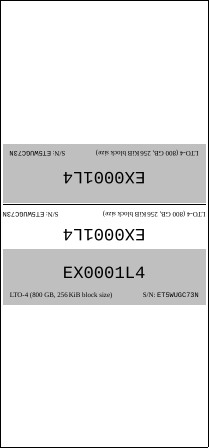
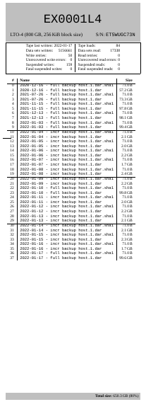

# LTO Ultrium Tape Label Scripts (lto-label-scripts)

**Scripts for generating LTO Ultrium tape labels/inserts**

[](https://www.gnu.org/licenses/gpl-3.0)

lto-label-scripts is a collection of Bash and Python scripts for generating [Linear Tape-Open (LTO) Ultrium](https://en.wikipedia.org/wiki/Linear_Tape-Open) tape inserts.
These can be put inside the plastic protective cases to display the tape cartridge's specifications, basic usage statistics and contents.
It has support for two types of labels:
- **Cover Inserts** (aka inlay, inlay card, tray card) and
- **Booklet Inserts** (folded)

Both are generated as PDF files using parameterized and customizable [XeLaTeX](https://en.wikipedia.org/wiki/XeTeX) templates.


## Example: LTO-4 Ultrium Tape Labels

See ['example' directory](example/) for a generated LTO Ultrium Generation 4 tape label as an example.

### Cover Insert

[](example/EX0001L4/cover.pdf)

### Booklet Insert

[](example/EX0001L4/booklet.pdf)

### Barcode Label


lto-label-scripts does not support generating barcode labels.
There are several barcode label generators available already, for example Dirk Riemekasten's nice [LTO Barcode-Label-Generator](https://tapelabel.de/).


## Printing recommendations

Covers are best printed on plain white DIN A4 paper sheets with a paper weight of 160 g/m² (cardboard).
Booklets can be printed on plain white DIN A4 paper sheets with a paper weight of 80–90 g/m² (office paper).
A paper cutter will help you to get clean cutting edges.


## Installation

### Setting up dependencies

lto-label-scripts have the following dependencies:

- A recent Linux distro
- [Python 3](https://www.python.org/)
- [sg3_utils](https://sg.danny.cz/sg/sg3_utils.html)
- [XeTeX](http://xetex.sourceforge.net/)
- [Latexmk](https://mg.readthedocs.io/latexmk.html)
- [Liberation fonts](https://github.com/liberationfonts/liberation-fonts/releases)

On a recent [Debian](https://www.debian.org/) system this should do the trick:

```
# apt install python3 sg3-utils texlive-xetex latexmk fonts-liberation
```

### Setting up lto-label-scripts

If you want, place the lto-label-scripts somewhere in your path, for example:

```
# cp -a create_tape_label generate_tape_label update_tape_* ~/.local/bin/
```

You probably already added your ordinary user to the `tape` group to allow non-root write operations to your tape drive.
To allow lto-label-scripts to collect statistics from your tape drive's SCSI log sense pages (via `update_tape_stats`) create a corresponding sudoers entry:

```
echo "%tape	ALL = NOPASSWD: /usr/bin/sg_logs --readonly --all /dev/nst[0-9]" > /etc/sudoers.d/sg_logs_tape
```

See `man sudoers` for details of your specific Linux distro.


## Workflow

Let's follow the typical workflow to demonstrate how lto-label-scripts are used.

### Initialize a directory for a set of tape cartridge labels

Start out with a new directory and put the template files from ['example' directory](example/) into it:

```
user@server:~/lto-label-scripts$ mkdir my-lto4-tapes
user@server:~/lto-label-scripts$ cp example/.[^.]* my-lto4-tapes/
```

### Generate a booklet for a new tape cartridge

The cover is generated once at the beginning of the lifecycle of the tape cartridge.
You do not need to insert the tape cartridge, just perform these steps.

1. Create a new tape label:
```
user@server:~/lto-label-scripts/my-lto4-tapes$ ../create_tape_label EX0001L4
Creating directory EX0001L4
* symlinking cover
* symlinking booklet
* creating sg_logs directory
* creating empty tape header
* creating empty tape statistics
* creating empty tape contents
```

2. Enter the tape cartridge's specifications; <kbd>Enter</kbd> will take over the default value (in square brackets):
```
user@server:~/lto-label-scripts/my-lto4-tapes$ ../update_tape_header EX0001L4
Cartridge Serial No.: ET5WUGC73N
Type [LTO-4]: 
Format [800~GB, \unit[256]{KiB} block size]: 
Write Date [2022-01-17]: 
Tape header file EX0001L4/inc_header.tex updated.
```

3. Generate cover `EX0001L4/cover.pdf`:
```
user@server:~/lto-label-scripts/my-lto4-tapes$ ../generate_tape_label EX0001L4
Generating tape label EX0001L4...
[...]
```

### Generate a booklet for a just written tape cartridge

The booklet is generated each time right after you finished dumping your datasets with the tape cartridge still inserted in your tape drive.

1. Update the tape cartridge's contents:
```
user@server:~/lto-label-scripts/my-lto4-tapes$ ../update_tape_contents EX0001L4 "/tmp/2022-01-17 - full backup host.1.dar.sha1" "/tmp/2022-01-17 - full backup host.1.dar"
Tape contents file EX0001L4/inc_content.tex updated.
```

Note that you have to hand over `update_tape_contents` the complete list of files on your tape cartridge in the correct order to get the correct result.

2. Update the tape cartridge's basic usage statistics:
```
user@server:~/lto-label-scripts/my-lto4-tapes$ ../update_tape_stats /dev/nst0 EX0001L4
Retrieving sg_logs from /dev/nst0 into EX0001L4/sg_logs/2022-01-17 21:46:29.out ... done
Updating tape statistics file EX0001L4/inc_stats.tex ... done
```

3. Generate booklet `EX0001L4/booklet.pdf`:
```
user@server:~/lto-label-scripts/my-lto4-tapes$ ../generate_tape_label EX0001L4
Generating tape label EX0001L4...
[...]
```

Then `mt offline` your tape drive as usual.


## See also

- [Amanda amreport](https://wiki.zmanda.com/man/3.5/amreport.8.html) – Generate a formatted output of statistics for [Amanda](http://www.amanda.org/), a popular Open Source Backup and Archiving software. If you are using Amanda for your tape backups, give it a try. It might be a better choice than lto-label-scripts.
- [DAR - Disk ARchive](http://dar.linux.free.fr/) – Create fault-tolerant, AES-encrypted archives.
- [mbuffer](https://www.maier-komor.de/mbuffer.html) – Avoid tape shoe-shining when dumping datasets to your tape cartridges.
